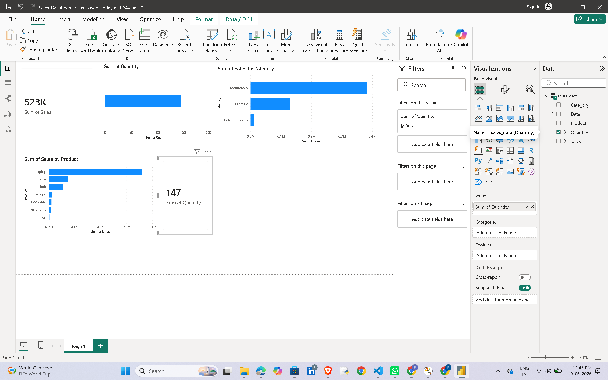

# 📊 Power BI Sales Dashboard

## Overview

This project presents an interactive Sales Dashboard built using Power BI Desktop. The dashboard provides insights into sales performance, product performance, category-wise revenue, and key business metrics through interactive visualizations.

## Objectives

* Analyze overall sales performance.
* Identify top-performing products and categories.
* Monitor revenue trends.
* Present business insights through interactive dashboards.

## Tools & Technologies

* Power BI Desktop
* Microsoft Excel / CSV Dataset
* Data Visualization
* Business Intelligence

## Dashboard Features

### KPI Cards

* Total Revenue
* Total Quantity Sold

### Revenue Analysis

* Revenue by Category
* Revenue by Product

### Trend Analysis

* Monthly Sales Trend

### Business Insights

* Best Performing Category
* Top Revenue Generating Products
* Sales Distribution Analysis

## Dataset Information

The dataset contains the following fields:

| Column   | Description       |
| -------- | ----------------- |
| Date     | Transaction Date  |
| Product  | Product Name      |
| Category | Product Category  |
| Quantity | Units Sold        |
| Sales    | Revenue Generated |

## Key Insights

* Technology category generated the highest revenue.
* Furniture was the second-highest contributor.
* Office Supplies contributed the least revenue.
* Product-level analysis helps identify top-selling items.
* KPI tracking enables quick business performance monitoring.

## Project Structure

```text
PowerBI-Sales-Dashboard/
│
├── Sales_Dashboard.pbix
├── sales_data.csv
├── dashboard_screenshot.png
└── README.md
```

## Dashboard Preview



## Future Improvements

* Add profit analysis.
* Create interactive slicers and filters.
* Build regional sales analysis.
* Connect dashboard to live data sources.

## Author

Prathibha

GitHub: https://github.com/Prathibha-26
